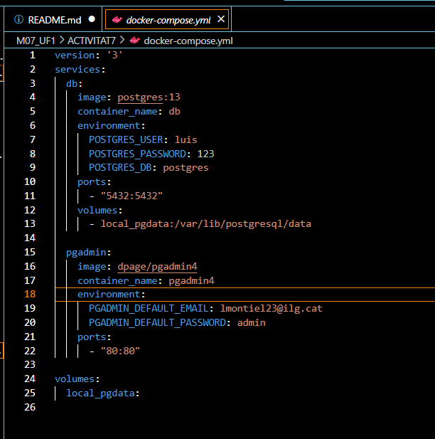
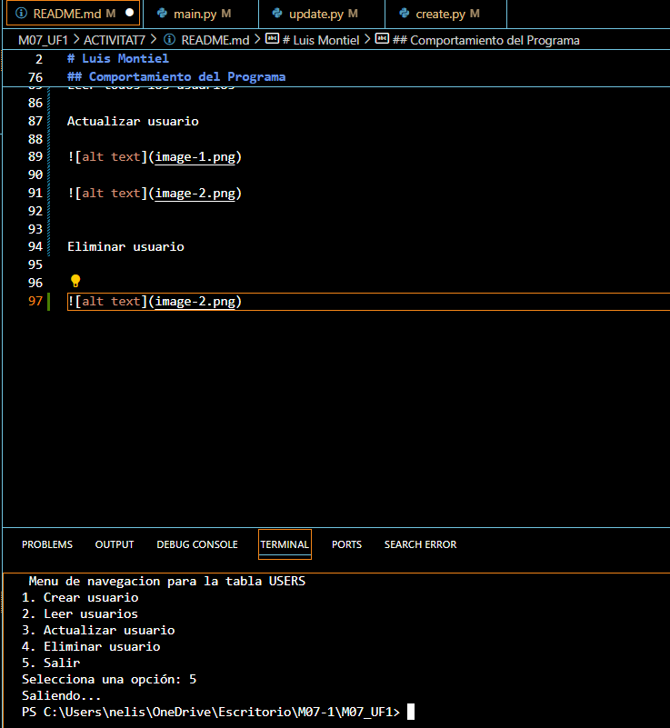
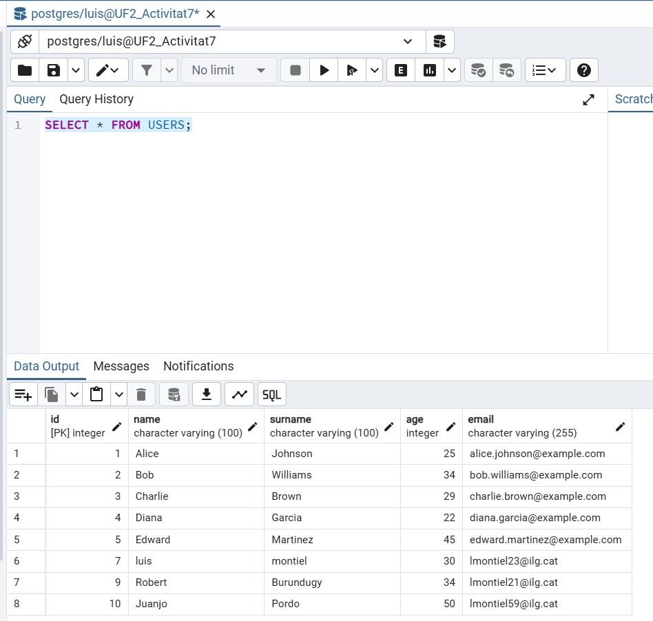

# Python y PostgreSQL
# Luis Montiel

En primer lugar, instalamos Docker en un entorno de Windows; seguidamente, instalamos PostgreSQL y Python en la terminal de Windows. Una vez hecho esto, creamos un archivo llamado docker-compose.yml con el siguiente contenido. Al levantar el contenedor, comenzamos a crear el archivo connection.py para verificar que se recibe la conexión. Después, empezamos a desarrollar el archivo main.py para realizar la conexión a la base de datos y llevar a cabo las operaciones create_table. Seguí una guía en internet para realizar la creación de la tabla, que incluía consultas SQL, y fui desarrollando main.py para ejecutar las operaciones necesarias.

Problemas que he tenido en el desarrollo: Al crear el docker-compose.yml, el contenedor no se levantaba; tuve que borrar el archivo que guarda los datos temporalmente. Una vez hecho eso, volví a ejecutar el código, y el contenedor se levantó correctamente. Otro problema al desarrollar el código fue que las consultas para leer la tabla no funcionaban, ya que me faltaba un cursor en la función de SQL. En el apartado de capturas puedes ver el desarrollo de la actividad.

## 0. Archivo docker-compose.yml

Define la configuración para el contenedor de PostgreSQL y Python.

## 1. Archivo connection.py

Define la función connect para establecer la conexión con la base de datos PostgreSQL.

psycopg2.connect(): Establece la conexión con PostgreSQL.

Retorno de `conn: La función devuelve el objeto de conexión conn, utilizado en otros archivos para ejecutar consultas SQL.

## 2. Archivo create.py

Contiene una función para crear la tabla USERS en la base de datos si no existe.

cursor.execute(): Ejecuta la consulta SQL para crear la tabla.
conn.commit(): Guarda los cambios en la base de datos.
cursor.close() y conn.close(): Cierra el cursor y la conexión con la base de datos.

## 3. Archivo create_table.py

Permite insertar un nuevo usuario en la tabla USERS.

INSERT INTO : Añade un nuevo registro a la tabla USERS.

Parámetros (%s, %s, %s, %s): Utiliza placeholders añadir valores a la tabla datos.

conn.commit(): Guarda el nuevo registro en la base de datos.

## 4. Archivo delete.py

Permite eliminar un usuario de la tabla USERS dado su id

- DELETE FROM USERS WHERE id = %s: Elimina el usuario cuyo id coincide con el proporcionado.

- Parámetro  user_id: Usa una tupla de un solo elemento para pasar el id de forma segura, evitando posibles inyecciones SQL.

## 5. Archivo main.py

Archivo principal que sirve como menú de selección para las operaciones CRUD.

Menú interactivo: Permite al usuario elegir qué operación realizar crear, leer, actualizar o eliminar.
Importación de módulos: Cada operación CRUD se delega al módulo correspondiente create, read, update, delete.
Validación de entrada: Asegura que la opción seleccionada es válida.

## 6. Archivo read.py

Define la función para leer consultar todos los usuarios de la tabla userS.

SELECT * FROM USERS: Consulta todos los registros en la tabla UserS.

cursor.fetchall(): Recupera todos los resultados de la consulta y los imprime en la consola.

## 7. Archivo update.py

Permite actualizar la información de un usuario en la tabla Users.

UPDATE USERS SET ... WHERE id = %s: Actualiza los campos de nombre, apellido, edad y correo de un usuario específico basado en su id.

Parámetros seguros: Utiliza placeholders para prevenir inyecciones SQL y pasar los valores de manera segura.

## Comportamiento del Programa

El programa genera un menú interactivo que permite a crear, leer, actualizar y eliminar registros. Cada operación se ejecuta de manera modular.

Crear Usuario

Leer todos los usuarios

Actualizar usuario

Eliminar usuario

Salir 

Resumen

